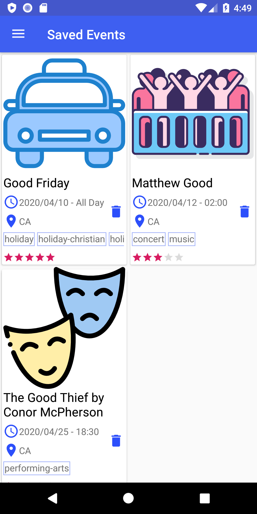

# NextEvent

## Overview

---

Event tracker for community and social events.

Browse an api-driven list of events and save them to your list for a more concise view, or add events to a built-in calendar for a bigger picture.

## Database

---

The Database that is created when you first open the app. This will store any events you save or add to the calendar. 

## Getting Started

---

### Events

When you start up the app, you are taken to the Events screen.

Entering a search will provide a list of events from the database. The search bar will only look for titles that contain the search the user entered. Tapping on one of the Events will take you to an screen that shows off the event's details.

### Event Details

The event details screen holds all the details about the event that you need. 

Tapping on the save icon saves the event to your saved events, so you can view it later. Clicking on More Info will take you to the website for the app. The Directions Icon will provide you will the exact location for the event, and the Share Icon will provide you with several options to share the event with your friends or family.

Finally, selecting the Add Event button will add the event to the in-app calendar, so you can plan out your event schedule.

### Calendar

The Calendar screen affords you a view of the events you have added to it. The day with the outlined blue square around it is the current day, and the day with the blue circle is the day you currently have selected. Just below the calendar you can see all the events you have on the day you have selected. If you wish to remove an event from that day, just tap on the trash icon.

### Saved Events

Saved Events provides you a view of all the events you have saved. If you wish to delete an event from this list, just tap the trash icon beside the event details.

### Settings

The Settings screen allows you to modify the way the app looks and functions. The layout style applies to the Events Screen and the Saved Events screen. The only show future/local events options will apply when searching the api, filtering your results so you have a more exact result set.

## Prerequisites

---

Users of this app must have a phone or tablet supporting Android 4.4 (KitKat) or greater.

## Libraries

---

The list of libraries used in this project.

- [Picasso](https://github.com/square/picasso)
- [Volley](https://github.com/google/volley)
- [Gson](https://github.com/google/gson)
- [CalendarView](https://github.com/kizitonwose/CalendarView)
- [ThreeTenABP](https://github.com/JakeWharton/ThreeTenABP)
- [FlexBox](https://github.com/google/flexbox-layout)
- [StickySwitch](https://github.com/GwonHyeok/StickySwitch)

## Authors

---

- Ghaith Darwish - [Github](https://github.com/gdarwish)
- Abel Anderson - [Github](https://github.com/AbelSAnderson) - [Linkedin](https://www.linkedin.com/in/abel-anderson)

## Acknowledgements

---

This app was built as a 2nd year project for the Mobile Application Development program at St. Clair College. Many thanks to our teacher, Cai Filiaut, for supporting us in this project & for his amazing suggestions - Team Gable

